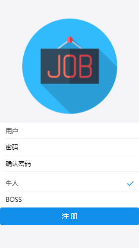
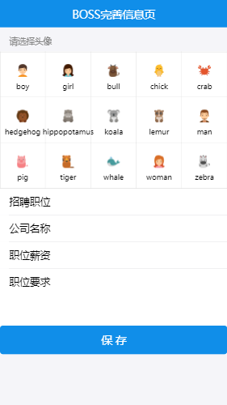
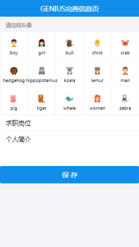

## 基于react+redux+websocket+express+moogodb实现的employee-app

本项目使用的是React实现的项目

### 注册页面效果图



### BOSS信息完善页面效果图



### GENIUS信息完善页面效果图



### 安装

```shell
git clone https://github.com/USTB-JeeLee/react-employee.git
cd my-demo
npm install
```
